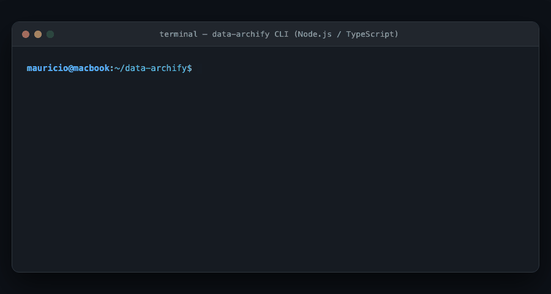
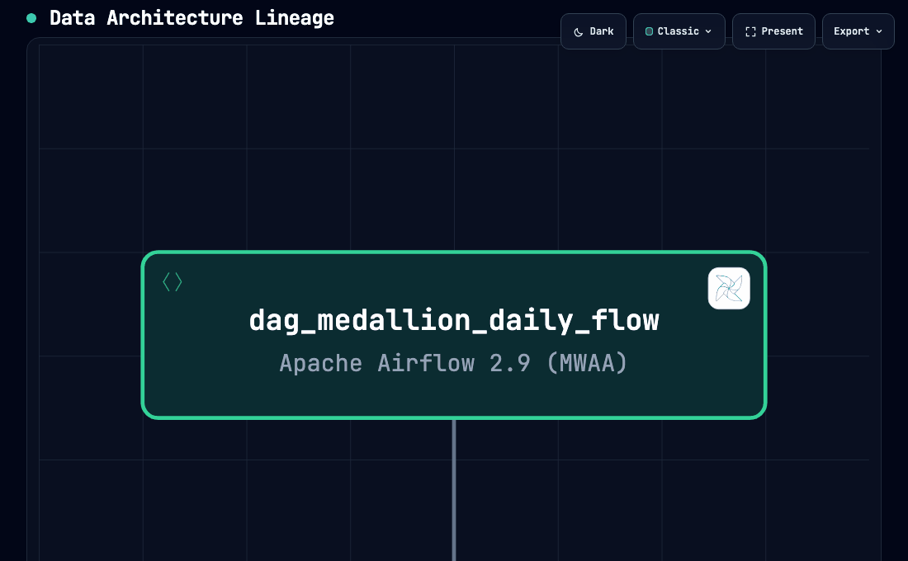
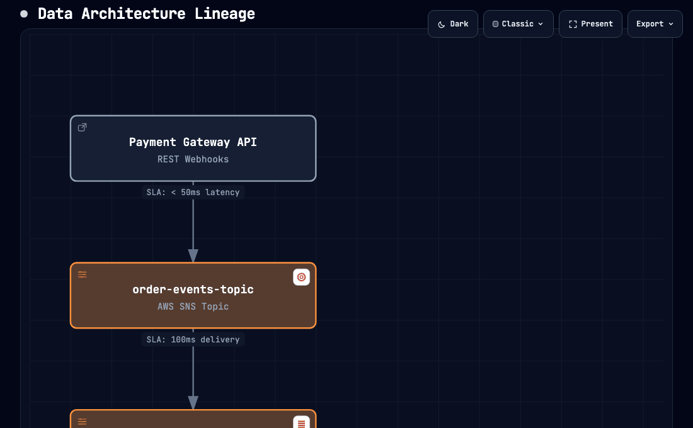
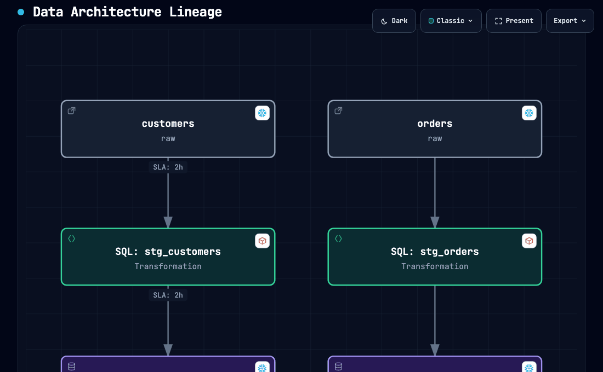
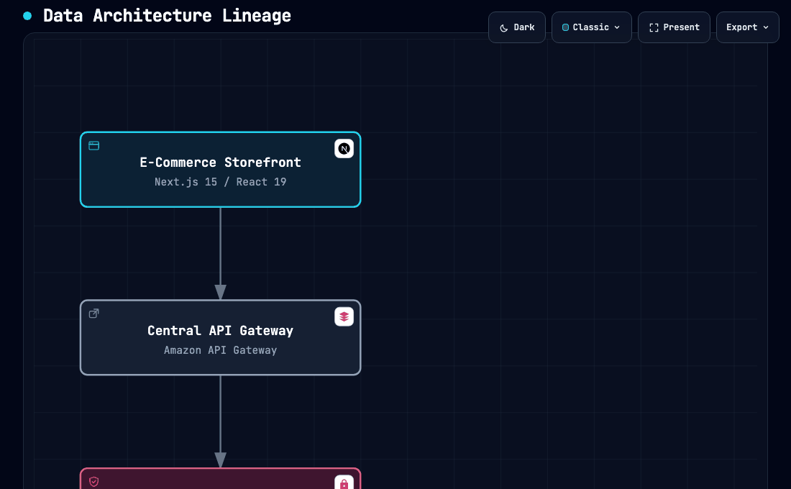

# 🏗️ data-archify

> **Universal Data Architecture, Lineage & Data Contracts Engine powered by Archify.**

Transform your **dbt models**, **Airflow DAGs**, **Terraform data infrastructure**, and custom cloud blueprints into interactive, publication-ready data architecture diagrams with embedded **Data Contracts**, **Column-level Lineage**, and **Compute Sizing**.

---

## 🎬 Demonstrations

### 1. Terminal Execution (`data-archify CLI`)
Compilation engine transforming dbt, Terraform, and custom templates into interactive SPAs:



---

### 2. Medallion Lakehouse — Data Contracts & Column Lineage
Full Medallion journey: **Airflow Orchestrator → Bronze Iceberg → dbt Silver Cleansing → Silver Table (columns + lineage) → dbt Gold Aggregation → Gold Marts KPIs**. Each node click reveals its Semantic Passport with `database.table`, SLA/SLO, Criticality, and column-level source lineage:



---

### 3. Event-Driven Ingestion — Streaming & Messaging
Real-time ingestion pipeline: **Payment Gateway → SNS Topic (15k msg/sec) → SQS FIFO Queue → SQS Dead-Letter Queue → Lambda Processor (512 MB, 10 workers) → S3 Bronze Lake**. Shows volumetry badges (throughput, retention) and compute cards:



---

### 4. Heavy Processing Lakehouse — Compute Sizing
Massive batch pipeline: **S3 Bronze (12 TB/day) → Glue Compactor (12 DPUs, 96 GB RAM) → Iceberg Silver (8 TB/day) → EMR Spark (16× r5.4xlarge, 2 TB RAM) → Databricks Photon → Gold Delta KPIs**. Highlights compute engine cards with hardware sizing and rationale:


---

### 5. dbt Bipartite Graph — Column-Level Lineage
Bipartite `Table ↔ SQL Process` graph built from `manifest.json`: **raw.customers → stg_customers (process) → stg_customers (dataset with columns) → raw.orders → stg_orders → customers Gold**. Drill-down reveals column upstream sources:



---

### 6. Enterprise Full Platform — End-to-End Multi-Layer Architecture
Complete enterprise multi-tier data platform covering **Storefront Web (Next.js 15) → API Gateway (AWS) → Secrets Manager → Order Service (Node.js) → Aurora PostgreSQL → SNS Topic → SQS FIFO → S3 Bronze → AWS Glue → Iceberg Silver → EMR Spark (2TB RAM) → Databricks Photon → Delta Lake Gold → Airflow MWAA → Snowflake Data Cloud → Grafana Observability → SES Notifications**. Features official AWS 2026 & Databricks brand marks:



---

### 7. 🎥 Complete Journey Video (`/video`)
A full high-definition video walkthrough capturing the entire workflow: terminal CLI execution, platform build, topological synthesis, and step-by-step interactive navigation across all 17 components:

- 🎬 **Video File**: [`video/data-archify-complete-journey.webm`](video/data-archify-complete-journey.webm) *(1.2 MB, 1280x720 30fps VP9 with live HUD overlays)*

---

## ✨ Key Features

- **🌐 Multi-Ecosystem Ingestion**:
  - **dbt**: Parses `manifest.json`, splitting models into Bipartite Graphs (`[Upstream] ➔ [SQL Process] ➔ [Target Dataset]`).
  - **Apache Airflow**: Connects to the Airflow REST API (`/api/v1/dags/{dag_id}/tasks`) to map task dependencies and visual TaskGroups.
  - **Terraform**: Scans `.tfstate` files to extract data cloud resources (S3, Glue, EMR, Databricks, Lambda, SNS, SQS).
  - **Custom Blueprints / Templates**: Render any data pipeline via custom JSON definitions.
- **⚙️ Compute & Capacity Sizing**:
  - Dedicated modeling for **AWS Glue**, **Amazon EMR (Spark)**, **Databricks (Photon/Delta Live Tables)**, and **AWS Lambda**.
  - Displays hardware sizing (workers, memory, DPUs) and architectural rationale directly inside the passport.
- **📬 Messaging & Event-Driven Ingestion**:
  - Native support for **AWS SNS**, **AWS SQS** (FIFO / Dead-Letter Queues), **Amazon Kinesis**, and **MSK (Kafka)**.
- **📊 Volumetry Metadata**:
  - Incorporate metrics like `15,000 events/sec`, `10 TB/day`, batch retention windows, and compaction frequencies.
- **📜 Data Contracts & Column-Level Lineage**:
  - Extracts column names, data types, descriptions, and upstream source columns (`source_columns`).
  - Exports a companion Markdown report (`*_contracts.md`) alongside every diagram for audits and data governance.
- **🛡️ Archify Visual Perfection**:
  - Built-in topological BFS engine ensures clean directional routing, avoiding crossing lines or diagram clutter.

---

## 🚀 Quick Start

### 1. Requirements
- Node.js `>= 18.0.0`
- npm

### 2. Installation
Clone the repository and install dependencies:
```bash
git clone https://github.com/tt-a1i/archify.git # or your custom fork
cd data-archify
npm install
npm run setup-vendor
npm run build
```

---

## 🛠️ CLI Commands & Usage

### 1. Render dbt Pipelines & Lineage
Reads `manifest.json`, builds bipartite transformation nodes, extracts contracts, and opens interactive column pop-ups:
```bash
data-archify dbt --manifest path/to/manifest.json --out lineage.html

# Optional model selection filter:
data-archify dbt --manifest path/to/manifest.json --select tag:finance --out finance.html
```

### 2. Render Airflow DAG Workflows
Connects to a live Airflow instance to map execution flow and TaskGroups:
```bash
# Set Airflow credentials in environment:
export AIRFLOW_USERNAME="admin"
export AIRFLOW_PASSWORD="password"

data-archify airflow --url http://localhost:8080 --dag my_etl_pipeline --out airflow_dag.html
```

### 3. Render Terraform Infrastructure
Parses a local `.tfstate` file, filtering data platform resources and inferring module groupings:
```bash
data-archify terraform --state path/to/terraform.tfstate --out infra.html
```

### 4. Render Architecture Templates
Render any architecture journey from the `templates/` folder:
```bash
data-archify render --input templates/01-event-driven-ingestion.json --out event_stream.html
```

---

## 📁 Architecture Journey Templates (`templates/`)

The `templates/` directory includes production-grade data architectures ready to use:

| Template | Focus | Components | Volumetry & Compute |
| :--- | :--- | :--- | :--- |
| [`01-event-driven-ingestion.json`](templates/01-event-driven-ingestion.json) | **Real-Time Streaming** | Webhook API ➔ SNS ➔ SQS (FIFO + DLQ) ➔ AWS Lambda ➔ S3 Bronze | `15,000 msgs/sec`, `35 GB/day`, Serverless 512MB |
| [`02-heavy-processing-lakehouse.json`](templates/02-heavy-processing-lakehouse.json) | **Big Data Batch Processing** | S3 Bronze ➔ AWS Glue Compactor ➔ Apache Iceberg ➔ Amazon EMR Spark ➔ Databricks Gold | `12 TB/day`, Glue 12 DPUs, EMR 16x r5.4xlarge (2TB RAM), Databricks Photon |
| [`03-medallion-lakehouse-orchestrated.json`](templates/03-medallion-lakehouse-orchestrated.json) | **Medallion Lakehouse & Governance** | Airflow Master DAG ➔ Bronze Iceberg ➔ dbt Silver Cleansing ➔ dbt Gold Marts | Full Data Contracts, column-level lineage, strict SLAs & SLOs |
| [`04-enterprise-full-platform.json`](templates/04-enterprise-full-platform.json) | **Enterprise Full Platform** | Next.js ➔ API Gateway ➔ Secrets Manager ➔ Node.js ➔ Aurora PG ➔ SNS ➔ SQS ➔ S3 ➔ Glue ➔ Iceberg ➔ EMR ➔ Databricks ➔ Airflow ➔ Snowflake ➔ Grafana ➔ SES | Full-Stack: 17 nodes across all 9 technical tiers, official 2026 AWS & Databricks brand marks |

To render all templates at once:
```bash
node dist/index.js render -i templates/01-event-driven-ingestion.json -o docs/01-event-driven.html
node dist/index.js render -i templates/02-heavy-processing-lakehouse.json -o docs/02-heavy-processing.html
node dist/index.js render -i templates/03-medallion-lakehouse-orchestrated.json -o docs/03-medallion.html
```

---

## 📂 Project Structure

```text
data-archify/
├── docs/
│   └── assets/                    # Animated GIFs (cli, medallion, event-driven, heavy, dbt, enterprise)
├── video/                         # Full journey HD videos (complete walkthrough)
├── src/
│   ├── airflow/                   # Airflow REST API consumer & DAG parser
│   ├── archify/                   # BFS topological builder & Archify CLI runner
│   ├── dbt/                       # dbt manifest.json parser & bipartite graph builder
│   ├── graph/                     # Generic DataGraph models (DataNode, Volumetry, Compute)
│   ├── portal/                    # DOM injector hijacking Archify's Semantic Passport
│   ├── report/                    # Markdown Data Contract report generator (*_contracts.md)
│   ├── terraform/                 # Terraform .tfstate parser for data & messaging resources
│   └── index.ts                   # CLI entrypoint (dbt, airflow, terraform, render)
├── templates/                     # Pre-built reference data architecture templates
├── tests/                         # Unit tests and mock manifests
├── vendor/archify/                # Local vendored Archify drawing engine
├── package.json
└── tsconfig.json
```

---

## 📜 License
ISC © 2026 Mauricio Helfstein
