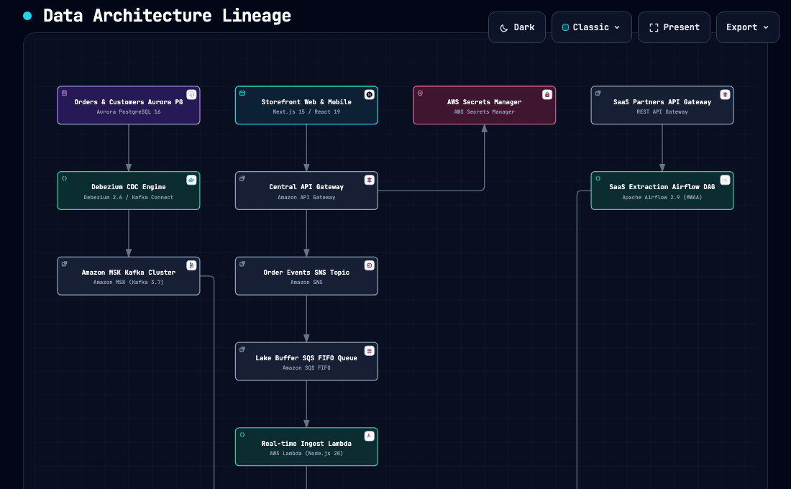

# 🏗️ data-archify

> **Universal Data Architecture, Lineage & Data Contracts Engine powered by Archify.**

[](package.json)
[](CHANGELOG.md)
[](LICENSE)

Transform your **dbt models**, **Airflow DAGs**, **Terraform data infrastructure**, and custom cloud blueprints into interactive, publication-ready data architecture diagrams with embedded **Data Contracts**, **Column-level Lineage**, and **Compute Sizing**.

---

## 🎬 Demonstrations

### 1. Terminal Execution (`data-archify CLI`)
Compilation engine transforming dbt, Airflow, Terraform, and custom templates into interactive SPAs:


---

### 2. Medallion Lakehouse — Data Contracts & Column Lineage
Full Medallion journey: **Airflow Orchestrator ➔ Bronze Iceberg ➔ dbt Silver Cleansing ➔ Silver Table (columns + lineage) ➔ dbt Gold Aggregation ➔ Gold Marts KPIs**. Each node click reveals its Semantic Passport with `database.table`, SLA/SLO, Criticality, and column-level source lineage:


---

### 3. Event-Driven Ingestion — Streaming & Messaging
Real-time ingestion pipeline: **Payment Gateway ➔ SNS Topic (15k msg/sec) ➔ SQS FIFO Queue ➔ SQS Dead-Letter Queue ➔ Lambda Processor (512 MB, 10 workers) ➔ S3 Bronze Lake**. Shows volumetry badges (throughput, retention) and compute cards:


---

### 4. Heavy Processing Lakehouse — Compute Sizing
Massive batch pipeline: **S3 Bronze (12 TB/day) ➔ Glue Compactor (12 DPUs, 96 GB RAM) ➔ Iceberg Silver (8 TB/day) ➔ EMR Spark (16× r5.4xlarge, 2 TB RAM) ➔ Databricks Photon ➔ Gold Delta KPIs**. Highlights compute engine cards with hardware sizing and rationale:


---

### 5. dbt Bipartite Graph — Column-Level Lineage
Bipartite `Table ↔ SQL Process` graph built from `manifest.json`: **raw.customers ➔ stg_customers (process) ➔ stg_customers (dataset with columns) ➔ raw.orders ➔ stg_orders ➔ customers Gold**. Drill-down reveals column upstream sources:


---

### 6. Enterprise Full Platform — End-to-End Multi-Layer Architecture
Complete enterprise multi-tier data platform covering **Storefront Web (Next.js 15) ➔ API Gateway (AWS) ➔ Secrets Manager ➔ Order Service (Node.js) ➔ Aurora PostgreSQL ➔ SNS Topic ➔ SQS FIFO ➔ S3 Bronze ➔ AWS Glue ➔ Iceberg Silver ➔ EMR Spark (2TB RAM) ➔ Databricks Photon ➔ Delta Lake Gold ➔ Airflow MWAA ➔ Snowflake Data Cloud ➔ Grafana Observability ➔ SES Notifications**. Features official AWS 2026 & Databricks brand marks:


---

### 7. Enterprise Tree Architecture — Multi-Trunk Ingestion & Fan-Out Branches
Complex 25-node non-linear tree architecture demonstrating multi-source fan-in (**OLTP CDC + Streaming Clickstream + SaaS Batch APIs**) converging into **S3 Bronze Lakehouse / Iceberg Silver**, and fanning out into 3 parallel consumption trees (**Analytics & BI, Real-time ML & Feature Store, and Operational Reverse ETL & Notifications**):



---

### 8. 🎥 Complete Journey Video (`/video`)
A full high-definition video walkthrough capturing the entire workflow: terminal CLI execution, platform build, topological synthesis, and step-by-step interactive navigation across all 25 components:

- 🎬 **Video File**: [`video/data-archify-complete-journey.webm`](video/data-archify-complete-journey.webm) *(2.5 MB, 1280x720 30fps VP9 at 1.5x speed with Depeche Mode style dark synth-pop soundtrack)*

---

## ✨ Key Features

- **🌐 Multi-Ecosystem Ingestion**:
  - **dbt**: Parses `manifest.json`, splitting models into Bipartite Transformation Graphs (`[Upstream Dataset] ➔ [SQL Process] ➔ [Target Dataset]`).
  - **Apache Airflow**: Connects to the Airflow REST API (`/api/v1/dags/{dag_id}/tasks`) to map task dependencies and visual TaskGroups.
  - **Terraform**: Scans `.tfstate` files to extract data cloud resources (S3, Glue, EMR, Databricks, Lambda, SNS, SQS).
  - **Custom Blueprints / Templates**: Render any data pipeline via custom JSON definitions.
- **⚙️ Compute & Capacity Sizing**:
  - Dedicated modeling for **AWS Glue**, **Amazon EMR (Spark)**, **Databricks (Photon/Delta Live Tables)**, **Apache Flink**, and **AWS Lambda**.
  - Displays hardware sizing (workers, memory, DPUs) and architectural rationale directly inside the passport.
- **📬 Messaging & Event-Driven Ingestion**:
  - Native support for **AWS SNS**, **AWS SQS** (FIFO / Dead-Letter Queues), **Amazon Kinesis**, and **MSK (Kafka)**.
- **📊 Volumetry Metadata**:
  - Incorporate metrics like `35,000 events/sec`, `12 TB/day`, batch retention windows, and compaction frequencies.
- **📜 Data Contracts & Column-Level Lineage**:
  - Extracts column names, data types, descriptions, and upstream source columns (`source_columns`).
  - Exports a companion Markdown report (`*_contracts.md`) alongside every diagram for audits and data governance.
- **🛡️ Archify Visual Perfection**:
  - Built-in topological BFS rank clustering engine ensures clean directional routing without line collisions.

---

## 🚀 Quick Start

### 1. Requirements
- Node.js `>= 18.0.0`
- npm

### 2. Installation
Clone the repository and build the engine:
```bash
git clone https://github.com/Helfstein-one/data-archify.git
cd data-archify
npm install
npm run setup-vendor
npm run build
```

---

## 🛠️ Detailed CLI Commands & Usage

`data-archify` provides subcommands for each ecosystem, automatically bundling your pipelines into interactive Single Page Applications (SPAs) and producing companion Markdown contract reports (`<output>_contracts.md`).

### 1. Render dbt Pipelines & Lineage (`dbt`)
Parses dbt `manifest.json` artifacts, constructs bipartite transformation nodes (`[Dataset] ➔ [SQL Process] ➔ [Dataset]`), extracts column definitions, and generates column lineage.

```bash
# Basic dbt manifest parsing:
node dist/index.js dbt --manifest path/to/manifest.json --out dbt_lineage.html

# Model selection filter (by tag, directory, or model name):
node dist/index.js dbt --manifest path/to/manifest.json --select tag:finance --out finance_lineage.html
```
- **Inputs**: `--manifest` (path to `manifest.json`), `--select` (optional model selection filter).
- **Outputs**: Interactive HTML diagram + `<output>_contracts.md` Markdown report.

---

### 2. Render Airflow DAG Workflows (`airflow`)
Connects to a live Apache Airflow REST API endpoint to map upstream/downstream task execution dependencies and visual TaskGroups.

```bash
# Set Airflow REST API credentials in environment:
export AIRFLOW_USERNAME="admin"
export AIRFLOW_PASSWORD="password"

node dist/index.js airflow --url http://localhost:8080 --dag my_etl_pipeline --out airflow_dag.html
```
- **Inputs**: `--url` (Airflow webserver base URL), `--dag` (DAG identifier), `--out` (output HTML path).
- **Outputs**: Interactive HTML DAG workflow + Markdown report.

---

### 3. Render Terraform Data Infrastructure (`terraform`)
Scans local `.tfstate` files, extracting cloud data resources (S3, Glue, EMR, Databricks, Lambda, SNS, SQS, Aurora) and module boundaries.

```bash
node dist/index.js terraform --state path/to/terraform.tfstate --out terraform_infra.html
```
- **Inputs**: `--state` (path to `terraform.tfstate`).
- **Outputs**: Infrastructure architecture diagram + Markdown report.

---

### 4. Render Reference Templates & Custom JSON (`render`)
Render any pre-built architecture journey or custom JSON blueprint:

```bash
# Render pre-built templates:
node dist/index.js render --input templates/01-event-driven-ingestion.json --out event_stream.html
node dist/index.js render --input templates/05-enterprise-tree-platform.json --out tree_platform.html
```
- **Inputs**: `--input` / `-i` (JSON blueprint path), `--out` / `-o` (HTML output path).
- **Outputs**: Interactive SPA HTML + `<output>_contracts.md` Data Contract report.

---

## 📝 Custom Architecture Blueprint Schema Guide

You can define custom multi-tier data architectures in JSON. The engine automatically parses nodes, computes topological ranks, formats SLAs, compute sizing cards, volumetry badges, and column lineage tables.

### JSON Blueprint Format

```json
{
  "nodes": [
    {
      "id": "db_orders",
      "name": "Orders Database",
      "type": "database",
      "category": "DATASET",
      "group": "sys-database",
      "brand": "postgresql",
      "sublabel": "Aurora PostgreSQL 16",
      "location": "aurora.cluster.us-east-1.rds.amazonaws.com:5432/orders",
      "description": "Primary transactional database handling order checkouts.",
      "metadata": {
        "sla": "< 5ms query latency",
        "slo": "99.999%",
        "criticality": "Critical",
        "owner": "@db-admin-team"
      },
      "volumetry": {
        "throughput": "15,000 req/sec",
        "volume_per_day": "120 GB/day",
        "retention": "7 years"
      },
      "compute": {
        "engine": "Aurora Multi-AZ Cluster",
        "sizing": "db.r6g.4xlarge (16 vCPU, 128GB RAM)",
        "rationale": "High-concurrency transactional OLTP store."
      },
      "columns": [
        {
          "name": "order_id",
          "type": "uuid",
          "description": "Primary transaction identifier"
        },
        {
          "name": "gross_amount",
          "type": "decimal(18,2)",
          "description": "Gross amount in USD",
          "source_columns": ["raw_checkout.amount_cents"]
        }
      ]
    }
  ],
  "edges": [
    {
      "source": "db_orders",
      "target": "lake_s3_bronze"
    }
  ]
}
```

### Node Schema Fields:
- `id` *(string)*: Unique node identifier.
- `name` *(string)*: Display name on canvas.
- `type` *(enum)*: `"frontend"` | `"backend"` | `"database"` | `"cloud"` | `"security"` | `"messagebus"` | `"external"`.
- `category` *(enum)*: `"PROCESS"` | `"DATASET"` | `"MESSAGING"`.
- `group` *(string)*: Functional tier grouping (e.g. `sys-frontend`, `sys-compute`, `sys-lakehouse`).
- `brand` *(string)*: Brand mark ID (e.g. `aws-s3`, `aws-glue`, `aws-emr`, `aws-lambda`, `aws-sns`, `aws-sqs`, `databricks`, `snowflake`, `postgresql`, `apache-kafka`, `apache-airflow`, `grafana`, `next-js`, `python`).
- `sublabel` *(string)*: Sub-caption (e.g. `Apache Iceberg 1.5`).
- `metadata` *(object)*: `sla`, `slo`, `criticality` (`Critical` | `High` | `Medium` | `Low`), `owner`.
- `volumetry` *(object)*: `throughput`, `records_per_day`, `volume_per_day`, `retention`.
- `compute` *(object)*: `engine`, `sizing`, `memory`, `rationale`.
- `columns` *(array)*: `name`, `type`, `description`, `source_columns` (array of upstream column paths).

---

## 🕹️ Interactive SPA Viewer Controls

When opening any generated HTML in a web browser, Archify's native viewer provides full interactive navigation:

| Control | Action | Hotkey / Trigger |
| :--- | :--- | :--- |
| **Presentation Mode** | Full-screen presentation stage for architecture reviews | Click **`Present`** / **`Exit`** |
| **Route Probe (`PATH`)** | Highlight end-to-end path connecting any source node to destination | Click **`PATH`** dock button |
| **Spatial Minimap (`MAP`)** | Toggle radar minimap and spatial coordinates | Click **`MAP`** dock button |
| **Semantic Lens (`LENS`)** | Filter components by operational tier or category | Click **`LENS`** dock button |
| **Node Finder (`🔍`)** | Search and highlight components instantly | Click **`🔍`** search button |
| **Zoom & Pan** | Zoom canvas scale in/out or reset to 100% | Click **`-`**, **`+`**, **`100%`** |
| **Data Contract Pop-up** | Open Semantic Passport displaying schemas, compute sizing, and column lineage | Click on any diagram node |

---

## 📁 Architecture Journey Templates (`templates/`)

The `templates/` directory includes 5 production-grade reference data architectures ready to use:

| Template | Focus | Components | Volumetry & Compute |
| :--- | :--- | :--- | :--- |
| [`01-event-driven-ingestion.json`](templates/01-event-driven-ingestion.json) | **Real-Time Streaming** | Webhook API ➔ SNS ➔ SQS (FIFO + DLQ) ➔ AWS Lambda ➔ S3 Bronze | `15,000 msgs/sec`, `35 GB/day`, Serverless 512MB |
| [`02-heavy-processing-lakehouse.json`](templates/02-heavy-processing-lakehouse.json) | **Big Data Batch Processing** | S3 Bronze ➔ AWS Glue Compactor ➔ Apache Iceberg ➔ Amazon EMR Spark ➔ Databricks Gold | `12 TB/day`, Glue 12 DPUs, EMR 16x r5.4xlarge (2TB RAM), Databricks Photon |
| [`03-medallion-lakehouse-orchestrated.json`](templates/03-medallion-lakehouse-orchestrated.json) | **Medallion Lakehouse & Governance** | Airflow Master DAG ➔ Bronze Iceberg ➔ dbt Silver Cleansing ➔ dbt Gold Marts | Full Data Contracts, column-level lineage, strict SLAs & SLOs |
| [`04-enterprise-full-platform.json`](templates/04-enterprise-full-platform.json) | **Enterprise Full Platform** | Next.js ➔ API Gateway ➔ Secrets Manager ➔ Node.js ➔ Aurora PG ➔ SNS ➔ SQS ➔ S3 ➔ Glue ➔ Iceberg ➔ EMR ➔ Databricks ➔ Airflow ➔ Snowflake ➔ Grafana ➔ SES | Full-Stack: 17 nodes across all 9 technical tiers, official 2026 AWS & Databricks brand marks |
| [`05-enterprise-tree-platform.json`](templates/05-enterprise-tree-platform.json) | **Enterprise Tree Architecture** | 3 Ingestion Trunks (CDC, Clickstream, SaaS) ➔ S3 Bronze Hub ➔ Iceberg Silver ➔ 3 Consumption Branches (Analytics, ML, Reverse ETL) | Multi-Layer Tree: 25 nodes & 24 directed edges across 9 operational tiers |

---

## 📂 Project Structure

```text
data-archify/
├── docs/
│   └── assets/                    # Animated GIFs (cli, medallion, event-driven, heavy, dbt, enterprise, tree)
├── video/                         # Full journey HD video (complete walkthrough)
├── src/
│   ├── airflow/                   # Airflow REST API consumer & DAG parser
│   ├── archify/                   # BFS topological builder & Archify CLI runner
│   ├── dbt/                       # dbt manifest.json parser & bipartite graph builder
│   ├── graph/                     # Generic DataGraph models (DataNode, Volumetry, Compute)
│   ├── portal/                    # DOM injector augmenting Archify's Semantic Passport
│   ├── report/                    # Markdown Data Contract report generator (*_contracts.md)
│   ├── terraform/                 # Terraform .tfstate parser for data & messaging resources
│   └── index.ts                   # CLI entrypoint (dbt, airflow, terraform, render)
├── templates/                     # Pre-built reference data architecture templates
├── tests/                         # Unit tests and mock manifests
├── vendor/archify/                # Local vendored Archify drawing engine
├── CHANGELOG.md                   # Release notes & version progression
├── package.json
└── tsconfig.json
```

---

## 📄 Documentation & Releases
- 📋 [Changelog (v1.0.0)](CHANGELOG.md)
- 🎬 [Complete Video Walkthrough](video/data-archify-complete-journey.webm)
- 📑 [Reference Templates](templates/)

---

## 📜 License
ISC © 2026 Mauricio Helfstein
